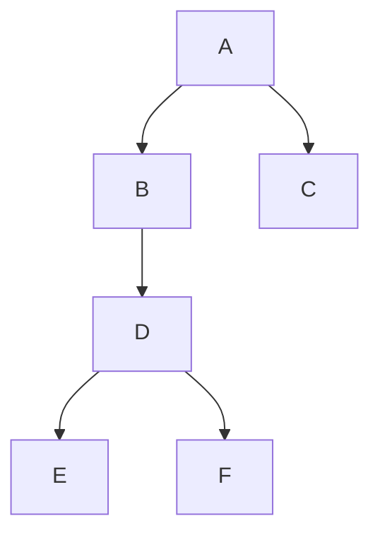
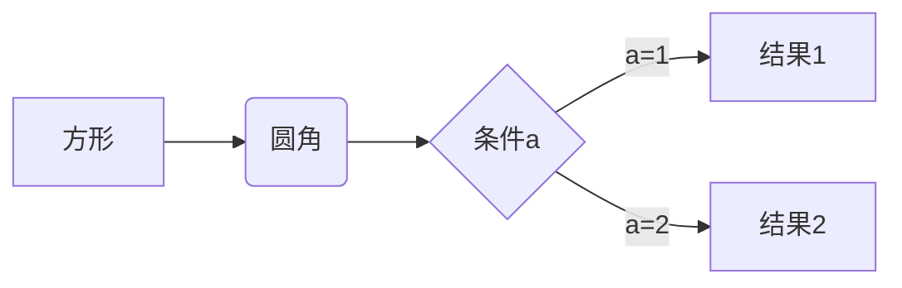
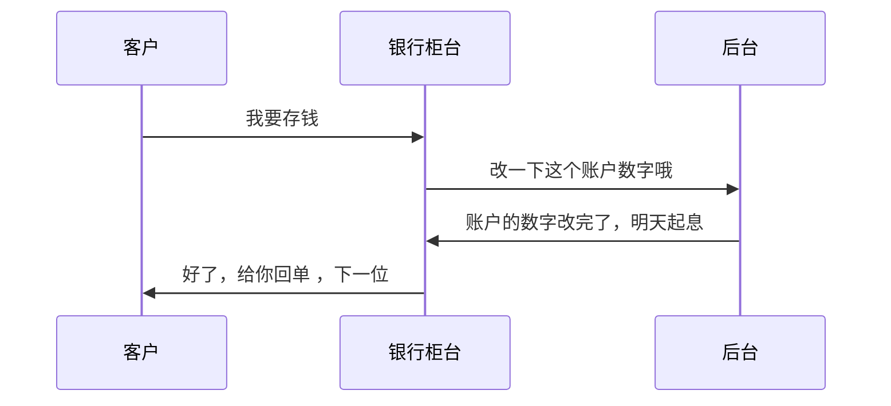
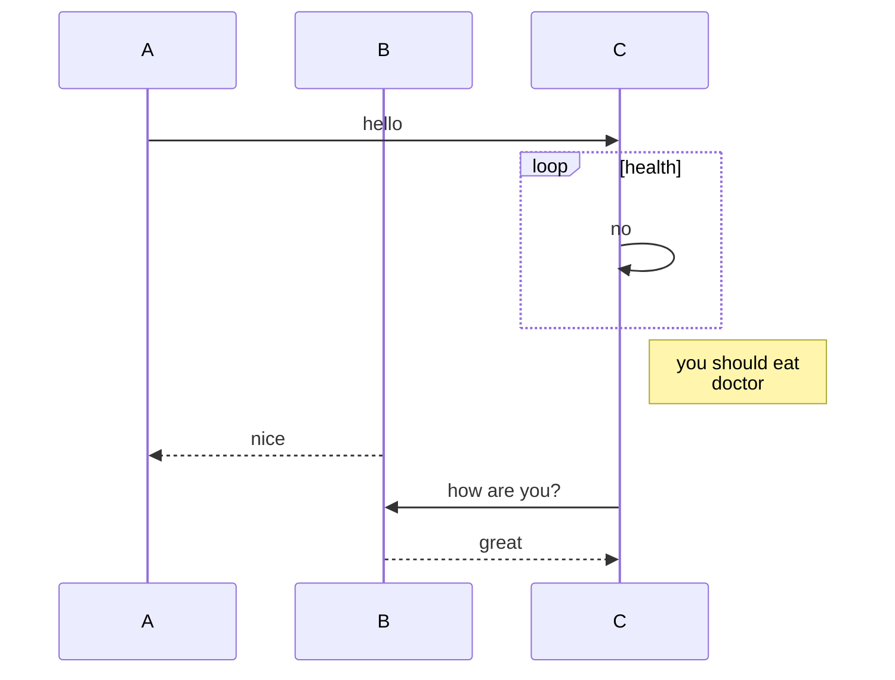
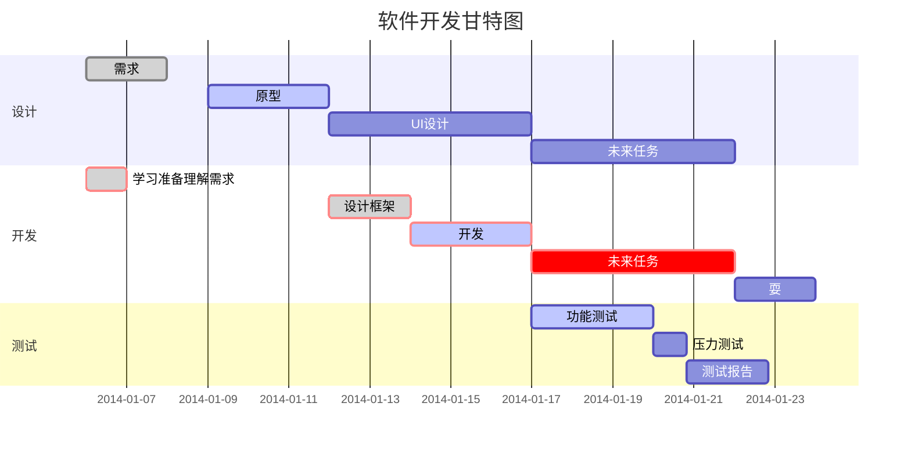
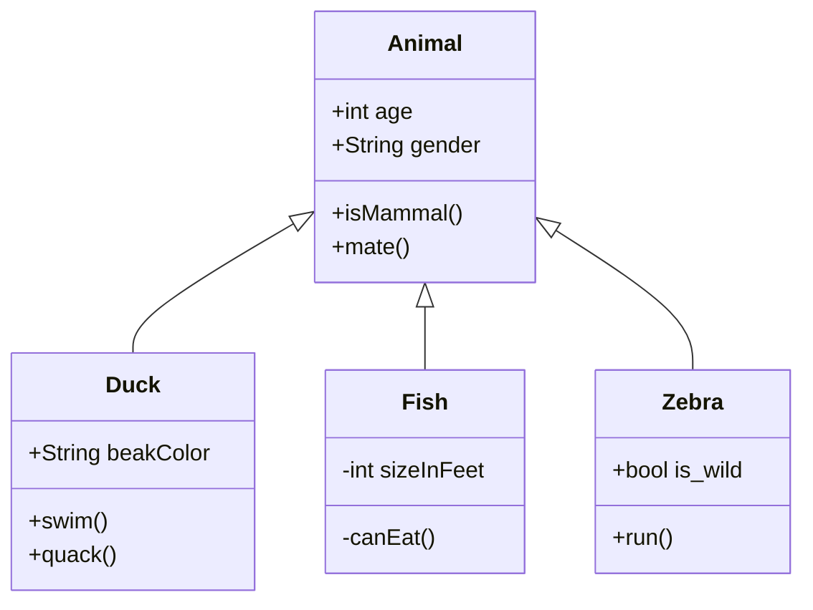
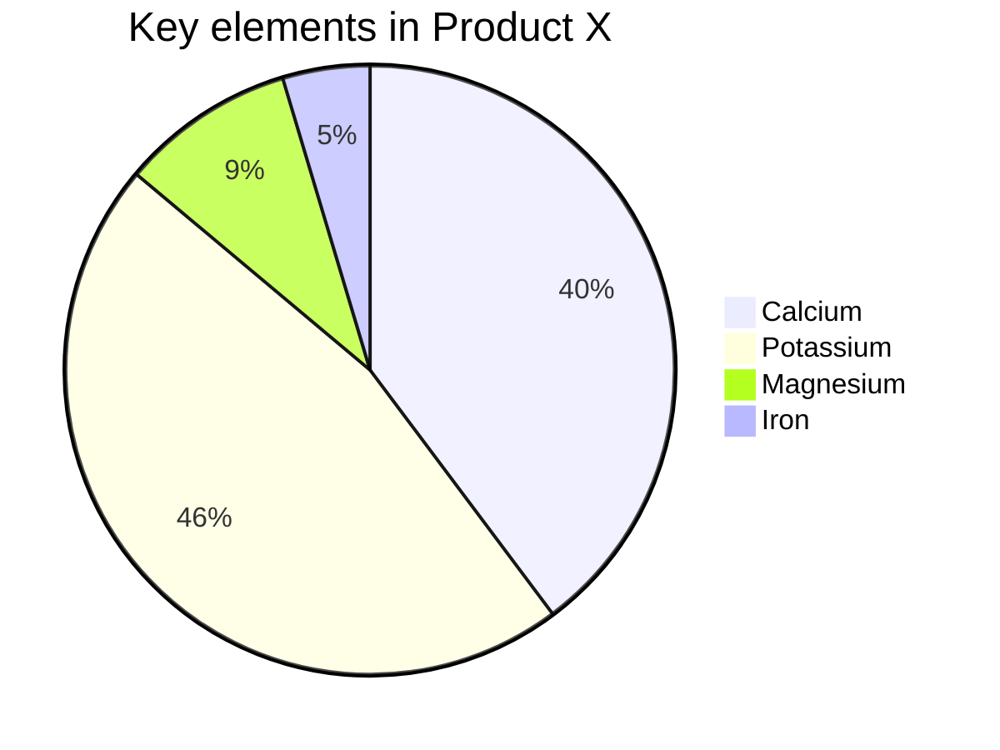

# embedddedArchitecture


# typora 如何制作流程图：

概述

首先在 Typora 中，输入 ```mermaid 然后敲击回车，即可初始化一张空白图。上面的三个```也就是esc健对应下面的健。
在空白处输入下面的源码即可，按照mermaid语法格式来操作即可。

## 一、流程图

### 1.竖向(TD表示从上到下)




### 2.横向（LR 表示从左到右）




### 3.标准（竖向）

​        先输入```flow 然后敲击回车，在输入栏，输入下面的语法即可

```flow
st=>start: 开始框
 
op=>operation: 处理框
 
cond=>condition: 判断框(是或否?)
 
sub1=>subroutine: 子流程
 
io=>inputoutput: 输入输出框
 
e=>end: 结束框
 
st->op->cond
 
cond(yes)->io->e
 
cond(no)->sub1(right)->op
```


4. ### 标准（横向） 

   ```flow
   st=>start: 开始框
    
   op=>operation: 处理框
    
   cond=>condition: 判断框(是或否?)
    
   sub1=>subroutine: 子流程
    
   io=>inputoutput: 输入输出框
    
   e=>end: 结束框
    
   st(right)->op(right)->cond
    
   cond(yes)->io(bottom)->e
    
   cond(no)->sub1(right)->op
   ```

   

## 二、UML时序图

- 先输入```mermaid (或）sequence
- ->> 代表实线箭头，–>> 则代表虚线箭头
- -> 直线，–>虚线
- 使用sequenceDiagram 则不使用``sequence

### 1.简单



### 2.复杂

```mermaid
sequenceDiagram
		title:标题：复杂使用
		对象A->>对象B:对象B你好吗（请求）
		Note right of 对象B:对象B的描述（提示）
		Note left of 对象A:提示
		对象B-->>对象A:我很好（响应）
		对象B->>对象C:你好吗？
		对象C-->>对象A: B找我了
		对象A->>对象B:你确定？
		note over 对象C,对象B:朋友
		participant D
		note right of D:没人陪我
```

### 3.复杂



### 4.复杂

```mermaid
sequenceDiagram
		participant A
		participant B
		participant C
		participant D
		title:"练习时序图"
		A->>B:request
		B->>B:verify sign
		B->>C:123
		C-->>B:321
		B->>C:456
		C->>C:code
		C->>D:789
		D-->>B:987
		alt yes
		Note right of B:yes的结果
		else no
		B-->>D:login
		D-->>B:login success
		end
		B->>B:加密
		B-->>A:return 
```


## 三、甘特图




## 四、类图




## 五、状态图


## 六、饼图




## github官网：

https://github.com/mermaid-js/mermaid/blob/develop/README.zh-CN.md

参考设计网站

https://www.jianguoyun.com/p/Dfun4HUQlP2vCRiC7vwD


# github的基本使用方法

## 一、查看远程仓库

```
git remote -v  //执行这个指令
//出现如下
origin  https://hub.fastgit.org/mooc-ui/embedddedArchitecture.git (fetch)
origin  https://hub.fastgit.org/mooc-ui/embedddedArchitecture.git (push)


```


## 二、如何提交代码到github：

```
git push git@git.zhlh6.cn:mooc-ui/embedddedArchitecture.git
```


## 三、如何同步github上的代码到本地

```
方法1：
git pull --rebase git@github.com:mooc-ui/embedddedArchitecture.git

方法2：
//http的地址会弹出你需要登录账号和密码的小框框，使用ssh的地址则不会
git fetch git@github.com:mooc-ui/embedddedArchitecture.git //注意这个地址是ssh的地址，不是http的地址

```


## 四、http地址和ssh地址的区别

正常我习惯使用ssh地址，这样的话可以免登录账号和密码，只需要配置一下token就行

```
http地址如下
https://github.com/mooc-ui/embedddedArchitecture.git

ssh地址如下：
git@github.com:mooc-ui/embedddedArchitecture.git
```


## 五、本地代码提交到github

```
git add . //将本地所有改到的地方添加到暂存区
git commit //将本地修改的地方提交到本地仓库
git push -u git@github.com:mooc-ui/embedddedArchitecture.git //将本地仓库的代码同步到github上
```


## 六、github上查看提交的历史记录


## 七、查看github上某个节点的改动点


## 八、查看某个节点的提交commit


## 九、github上查找文件


## 十、github创建一个远程新分支


## 十一、同步远程github里面所有的远程分支

```bash
git remote add origin git@git.zhlh6.cn:mooc-ui/embedddedArchitecture.git
git fetch origin branchname  //例如：git fetch origin doublelist

```

## 十二、提交本地修改到远程指定分支

```bash
git branch -a //查看远程分支同步到本地的情况
git checkout branch_name  //切换到你想要提交的分支
git pull --rebase git@git.zhlh6.cn:mooc-ui/embedddedArchitecture.git //将本地节点和远程分支的节点同步，该过程可能会出现冲突文件，需要手动解决
git stash apply stash_num //将本地修改的东西从stash里面弹出来
git commit //将修改内容提交到本地
git push git@git.zhlh6.cn:mooc-ui/embedddedArchitecture.git //将本地的提交同步到远程github仓库
```

